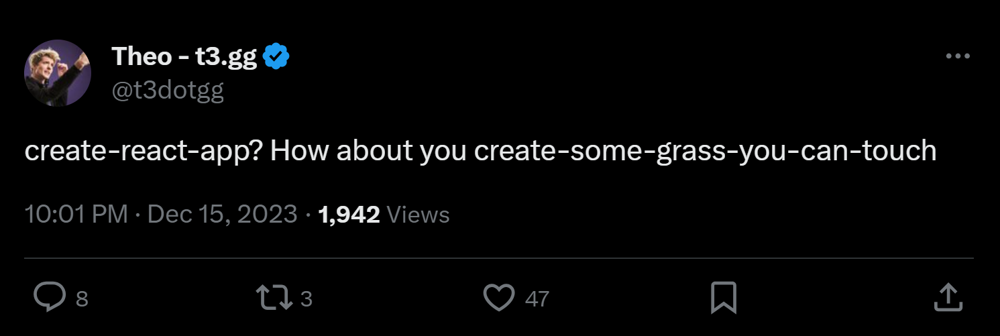

# create-some-grass-you-can-touch

See [x.com/t3dotgg/status/1735766941586071670](https://twitter.com/t3dotgg/status/1735766941586071670) for context



[npmjs.com/create-some-grass-you-can-touch](https://www.npmjs.com/package/create-some-grass-you-can-touch)

```shell
npx create-some-grass-you-can-touch
```

Open for suggestions about what this package should contain (e.g. animated ASCII art of blades of grass?).
